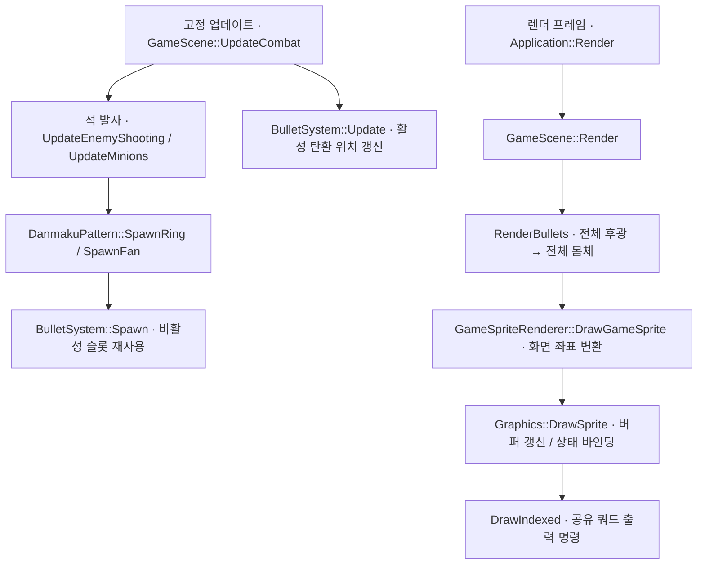

# 대량 탄막 렌더링 — 사용자 초안 리뷰

Notion: https://app.notion.com/p/3f1d058c022e809aad5fd4b072492e01
사용자가 작성한 임시 하위 문서. 이후 기존 포트폴리오 렌더링 파트로 합친다.

<empty-block/>
<empty-block/>
## 문제 정의
Release 빌드에서 스테이지별 FPS를 확인했다.
일반 적 10마리가 순차적으로 등장하는 1스테이지에서 약 **400 FPS**를 관찰했다.
<columns>
	<column ratio="50">
		
	</column>
	<column ratio="50">
		
		<empty-block/>
	</column>
</columns>
중간보스전에서는 약 **370 FPS**를 관찰했다.
<columns>
	<column ratio="50">
		
	</column>
	<column ratio="50">
		
	</column>
</columns>
<empty-block/>
탄환이 약 1,000개인 최종보스 장면에서는 약 **126 FPS**를 관찰했다.
탄막이 늘어난 장면에서 FPS가 낮아지는 현상을 확인했다. 장면별 적 수·패턴·화면 겹침이 함께 달라지므로, 이 비교만으로 원인을 확정할 수는 없다.
<columns>
	<column ratio="50">
		
	</column>
	<column ratio="50">
		
	</column>
</columns>
## 관찰 조건
<table header-row="true" fit-page-width="true">
<tr><td>항목</td><td>확인 내용</td></tr>
<tr><td>CPU</td><td>Intel Core i7-11800H · 8코어 / 16스레드</td></tr>
<tr><td>GPU 구성</td><td>NVIDIA GeForce RTX 3080 Laptop GPU / Intel UHD Graphics</td></tr>
<tr><td>메모리</td><td>64 GiB</td></tr>
<tr><td>OS</td><td>Windows 11 Pro · 10.0.26120</td></tr>
<tr><td>그래픽 API</td><td>DirectX 11 · 하드웨어 디바이스</td></tr>
<tr><td>기본 해상도</td><td>창 클라이언트 1920×1080 / 전투 논리 좌표 720×960</td></tr>
<tr><td>수직동기화</td><td>Present(0, 0) · 앱에서 동기 간격 0</td></tr>
</table>
실행 환경은 **Release 빌드**다. 설치 사양은 Windows 조회 결과이며 해상도·VSync는 현재 소스의 기본 설정이다.
<details>
<summary>FPS 표시 기준</summary>
	FPS는 Application::UpdateFps에서 약 1초 동안의 프레임 수를 경과 시간으로 나눈 값이다. 특정 Draw의 실행 시간이나 GPU 구간 시간이 아니다.
</details>
## 원인 조사
어느 구간의 비용이 증가하는지 확인하기 위해 **게임 업데이트 / CPU 렌더 제출 / GPU 렌더링**을 나눠 살펴본다.
### 현재 탄환 렌더링 경로
탄환은 미리 확보한 **8,192개 풀 슬롯** 중 비활성 슬롯을 찾아 재사용한다. 생성·이동·충돌은 60Hz 고정 업데이트에서 처리하고, 화면 출력은 별도 렌더 루프에서 수행한다.

위치 갱신은 해당 틱의 적 탄환 생성보다 먼저 실행된다. 생성된 탄환은 이후 충돌·화면 밖 제거를 거쳐 렌더 경로에서 읽는다.
기본 표현에서는 풀을 두 번 순회한다. 첫 순회는 모든 후광, 두 번째는 모든 몸체를 그려 후광이 몸체를 덮는 것을 줄인다. 두 순회 모두 비활성 슬롯은 건너뛴다.
정점·인덱스 버퍼와 셰이더는 공유한다. 탄환마다 GPU 객체를 새로 만드는 구조는 아니지만, 각 스프라이트의 변환과 색·효과 상수 버퍼는 매번 갱신한다. 텍스처·샘플러·블렌드 바인딩 호출도 반복된다.
후광은 White 텍스처에 거리 감쇠를 적용하고 기본 Additive로 합성한다. 몸체는 별도 shape 분기와 Alpha 합성을 사용한다.
<details>
<summary>탄환 생성과 위치 갱신</summary>
	`src/BulletSystem.cpp` · 현재 소스 발췌
	```cpp
void BulletSystem::Spawn(float centerX, float centerY, float velocityX,
                         float velocityY, BulletOwner owner, BulletType type) {
  ++spawnRequests_;
  auto target = std::ranges::find(bullets_, false, &Bullet::active);
  if (target != bullets_.end()) {
    const auto style = GetBulletStyle(type);
    *target = Bullet{centerX,      centerY, velocityX, velocityY, style.width,
                     style.height, owner,   false,     true,      type};
  } else {
    ++droppedSpawnRequests_;
  }
}

void BulletSystem::Update(double fixedDeltaSeconds) {
  for (auto &bullet : bullets_) {
    if (!bullet.active) {
      continue;
    }
    bullet.x += bullet.velocityX * static_cast<float>(fixedDeltaSeconds);
    bullet.y += bullet.velocityY * static_cast<float>(fixedDeltaSeconds);
  }
}
	```
</details>
<details>
<summary>후광과 몸체를 나눠 그리는 루프</summary>
	`src/GameSceneRendering.cpp` · 현재 소스 발췌
	```cpp
void GameScene::RenderBullets(const GameSpriteRenderer &renderer) const {
  if (visuals_.enhancedBullets) {
    // 모든 후광을 먼저 그리고 몸체를 올려 탄의 경계를 유지한다.
    for (int layer = 0; layer < 2; ++layer) {
      const bool isGlow = layer == 0;
      for (const auto &bullet : bulletSystem_.GetBullets()) {
        if (!bullet.active)
          continue;
        SpriteDrawData sprite{
            {bullet.x, bullet.y},
            {bullet.width, bullet.height},
            SpriteTextureId::White,
            bullet.owner == BulletOwner::Player
                ? std::array<float, 4>{0.15f, 0.75f, 1.0f, 1.0f}
                : std::array<float, 4>{1.0f, 0.18f, 0.12f, 1.0f},
        };
        if (bullet.type == BulletType::Thin &&
            (bullet.velocityX != 0.0f || bullet.velocityY != 0.0f)) {
          sprite.rotationRadians =
              std::atan2(bullet.velocityY, bullet.velocityX);
        }
        sprite.shape =
            isGlow ? SpriteShape::GlowCircle : SpriteShape::BulletBody;
        sprite.blendMode =
            isGlow ? visuals_.bulletBlendMode : SpriteBlendMode::Alpha;
        if (isGlow) {
          constexpr float kGlowPadding = 16.0f;
          sprite.size[0] += kGlowPadding;
          sprite.size[1] += kGlowPadding;
          sprite.tint[3] = 0.25f;
        }
        renderer.DrawGameSprite(sprite);
      }
    }
    return;
  }
  for (const auto &bullet : bulletSystem_.GetBullets()) {
    if (!bullet.active) {
      continue;
    }
    const float rotation =
        bullet.type == BulletType::Thin &&
                (bullet.velocityX != 0.0f || bullet.velocityY != 0.0f)
            ? std::atan2(bullet.velocityY, bullet.velocityX)
            : 0.0f;

    const std::array<float, 4> bulletTint =
        bullet.owner == BulletOwner::Player
            ? std::array<float, 4>{0.15f, 0.75f, 1.0f, 1.0f}
            : std::array<float, 4>{1.0f, 0.18f, 0.12f, 1.0f};

    if (visuals_.bulletShape == SpriteShape::GlowCircle) {
      auto glowTint = bulletTint;
      for (std::size_t channel = 0; channel < 3; ++channel) {
        glowTint[channel] *= 1.8f;
      }
      glowTint[3] = 0.65f;
      const SpriteDrawData glowSprite{
          {bullet.x, bullet.y},
          {bullet.width * 3.0f, bullet.height * 3.0f},
          SpriteTextureId::White,
          glowTint,
          SpriteTimeSource::Game,
          {0.0f, 0.0f, 1.0f, 1.0f},
          SpriteShape::GlowCircle,
          visuals_.bulletBlendMode,
          rotation,
      };
      renderer.DrawGameSprite(glowSprite);

      const SpriteDrawData coreSprite{
          {bullet.x, bullet.y},
          {bullet.width, bullet.height},
          SpriteTextureId::White,
          bulletTint,
          SpriteTimeSource::Game,
          {0.0f, 0.0f, 1.0f, 1.0f},
          SpriteShape::SoftCircle,
          SpriteBlendMode::Alpha,
          rotation,
      };
      renderer.DrawGameSprite(coreSprite);
      continue;
    }

    const SpriteDrawData bulletSprite{
        {bullet.x, bullet.y},
        {bullet.width, bullet.height},
        SpriteTextureId::White,
        bulletTint,
        SpriteTimeSource::Game,
        {0.0f, 0.0f, 1.0f, 1.0f},
        visuals_.bulletShape,
        visuals_.bulletBlendMode,
        rotation,
    };
    renderer.DrawGameSprite(bulletSprite);
  }
}
	```
</details>
<details>
<summary>게임 좌표를 화면 좌표로 전달</summary>
	`src/GameSpriteRenderer.cpp` · 현재 소스 발췌
	```cpp
void GameSpriteRenderer::DrawGameSprite(const SpriteDrawData &sprite) const {
  graphics_.DrawSprite(layout_.ToScreen(sprite));
}
	```
</details>
<details>
<summary>스프라이트별 데이터 설정과 Draw</summary>
	`src/Graphics.cpp` · 현재 소스 발췌
	```cpp
void Graphics::DrawSprite(const SpriteDrawData &sprite) {
  BindSpriteTexture(sprite.texture);
  BindSpriteSampler(sprite.samplerMode, sprite.addressMode);
  SetSpriteTransform(sprite.center[0], sprite.center[1], sprite.size[0],
                     sprite.size[1], sprite.rotationRadians);
  UpdateSpriteConstants();
  spriteTintConstants_.tint = sprite.tint;
  spriteTintConstants_.timeSource = static_cast<float>(sprite.timeSource);
  spriteTintConstants_.shape = static_cast<float>(sprite.shape);
  spriteTintConstants_.uvRect = sprite.uvRect;
  spriteTintConstants_.dissolveProgress = sprite.dissolveProgress;
  spriteTintConstants_.dissolveNoiseScale = sprite.dissolveNoiseScale;
  spriteTintConstants_.dissolveEdgeWidth = sprite.dissolveEdgeWidth;
  spriteTintConstants_.dissolveEdgeStrength = sprite.dissolveEdgeStrength;
  spriteTintConstants_.dissolveEdgeColor = sprite.dissolveEdgeColor;
  UpdateSpriteTintConstants();
  BindBlendState(sprite.blendMode);

  context_->DrawIndexed(6, 0, 0);
}
	```
</details>
<details>
<summary>두 상수 버퍼의 Map / Unmap</summary>
	`src/Graphics.cpp` · 현재 소스 발췌
	```cpp
void Graphics::UpdateSpriteConstants() {
  D3D11_MAPPED_SUBRESOURCE mapped{};
  ThrowIfFailed(context_->Map(spriteConstantBuffer_.Get(), 0,
                              D3D11_MAP_WRITE_DISCARD, 0, &mapped),
                "Failed to map the sprite constant buffer.");
  *static_cast<SpriteConstants *>(mapped.pData) = spriteConstants_;
  context_->Unmap(spriteConstantBuffer_.Get(), 0);
}

void Graphics::UpdateSpriteTintConstants() {
  D3D11_MAPPED_SUBRESOURCE mapped{};

  ThrowIfFailed(context_->Map(spriteTintConstantBuffer_.Get(), 0,
                              D3D11_MAP_WRITE_DISCARD, 0, &mapped),
                "Failed to map sprite tint constant buffer.");

  *static_cast<SpriteTintConstants *>(mapped.pData) = spriteTintConstants_;

  context_->Unmap(spriteTintConstantBuffer_.Get(), 0);
}
	```
</details>
<details>
<summary>후광·몸체의 픽셀 처리</summary>
	`shaders/Sprite.hlsl` · 현재 소스 발췌
	```cpp
float4 PSMain(VSOutput input) : SV_TARGET
{
    float2 sampleUV = TransformSpriteUV(input.uv);
    float4 color = spriteTexture.Sample(spriteSampler, sampleUV) * spriteTint;
    if (dissolveProgress > 0.0f)
    {
        float noiseValue = ComputeDissolveNoise(input.uv);
        ApplyDissolve(noiseValue, dissolveProgress);
        float edgeIntensity = ComputeDissolveEdgeIntensity(
            noiseValue, dissolveProgress, dissolveEdgeWidth);
        color.rgb += dissolveEdgeColor.rgb * dissolveEdgeStrength * edgeIntensity;
    }
    float effectTime = spriteTimeSource > 0.5f ? realTimeSeconds : gameTimeSeconds;
    //color.rgb *= ComputePulse(effectTime);
    if (spriteShape > 2.5f)
    {
        const float kBulletCoreRadius = 0.22f;
        float normalizedDistance = length(input.uv - float2(0.5f, 0.5f))
                                 / kBulletCoreRadius;
        float coreIntensity = saturate(ComputeBulletCoreIntensity(normalizedDistance));
        color.rgb = lerp(color.rgb, float3(1.0f, 1.0f, 1.0f), coreIntensity);
        color.a *= ComputeShapeAlpha(input.uv);
    }
    else if (spriteShape > 1.5f)
    {
        color.a *= ComputeGlowIntensity(input.uv);
    }
    else if (spriteShape > 0.5f)
    {
        color.a *= ComputeShapeAlpha(input.uv);
    }
    return color;
}
	```
</details>
<empty-block/>
### 측정 방법
CPU에서는 고정 업데이트 묶음, 스프라이트 렌더 제출, UI 출력, Present 구간을 분리해 시간을 기록한다. 렌더 함수의 CPU 경과 시간에는 드라이버 처리나 대기가 섞일 수 있으므로 GPU 시간과 동일하게 해석하지 않는다.
GPU에서는 D3D11 Timestamp와 Timestamp Disjoint 쿼리로 탄환 출력 구간의 시작·끝을 기록한다. 주파수와 Disjoint 여부를 확인하고 완료된 결과를 뒤에서 읽어, 결과를 기다리는 행위가 매 프레임 측정을 방해하지 않도록 한다. [D3D11 쿼리 종류](https://learn.microsoft.com/en-us/windows/win32/api/d3d11/ne-d3d11-d3d11_query)
비교 시에는 같은 탄환 수·배치·후광 크기·해상도·빌드를 유지한다. 후광을 끄면 Draw와 픽셀 처리가 함께 줄어들기 때문에 FPS 증가만으로 CPU/GPU 중 어느 쪽이 원인인지 결정하지 않는다.
\[동일 장면의 CPU 업데이트·렌더 제출·Present / GPU 탄환 구간 측정 결과\]
### 첫 번째 가설: 탄환별 렌더 제출 비용
현재 경로는 탄환의 후광과 몸체를 각각 그린다. 활성 탄환 수가 증가하면 Draw 호출과 상수 버퍼 갱신도 증가하므로, CPU 렌더 제출 비용을 첫 번째 조사 대상으로 삼는다.
공식 문서는 이 가설의 배경으로 사용하고, 실제 병목 여부는 동일 조건의 측정으로 확인한다.
<table header-row="true" fit-page-width="true">
<tr><td>탄환 렌더링 부분</td><td>활성 탄환 N발</td><td>1,000발 예시</td></tr>
<tr><td>DrawIndexed</td><td>2N</td><td>2,000회</td></tr>
<tr><td>Map</td><td>4N</td><td>4,000회</td></tr>
<tr><td>Unmap</td><td>4N</td><td>4,000회</td></tr>
</table>
기본 후광+몸체 경로의 코드상 호출 수다. 사진 장면의 실측 카운터가 아니며, 배경·캐릭터·UI·프레임 상수 갱신은 제외한다. 같은 상태의 바인딩 호출 횟수와 실제 GPU 상태 변경 횟수도 구분한다.
Microsoft는 많은 객체를 그릴 때 Draw를 묶어 제출 비용을 줄이는 방향을 설명한다. 이 설명은 현재 경로를 조사할 근거이며, 우리 게임의 원인을 증명하는 측정 결과는 아니다. [Direct3D 11 렌더링 파이프라인](https://learn.microsoft.com/en-us/windows/win32/direct3dgetstarted/understand-the-directx-11-2-graphics-pipeline)
<empty-block/>
\[측정 결과에 따른 가설 검증과 다음 실험\]
<empty-block/>
<empty-block/>
<empty-block/>
<empty-block/>
