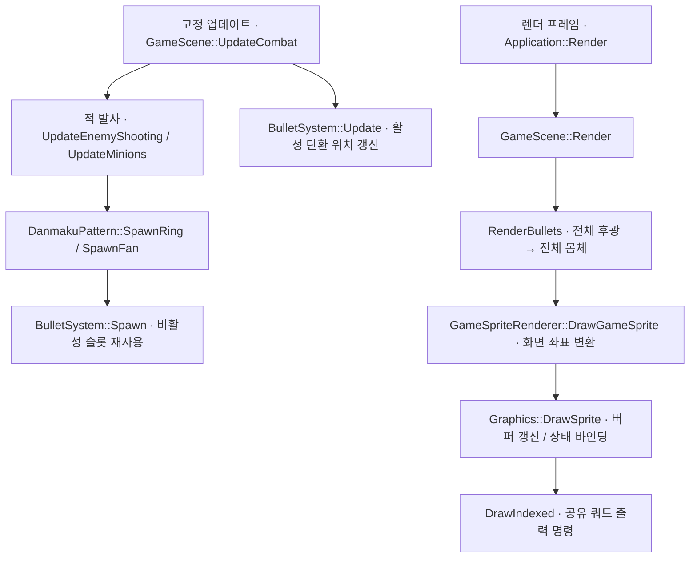

# 대량 탄막 렌더링 — 사용자 초안 리뷰

Notion: https://app.notion.com/p/3f1d058c022e809aad5fd4b072492e01
사용자가 작성한 임시 하위 문서. 이후 기존 포트폴리오 렌더링 파트로 합친다.

<empty-block/>
<empty-block/>
## 문제 정의
Release 빌드에서 스테이지별 FPS를 확인했다.
일반 적 10마리가 순차적으로 등장하는 1스테이지에서 약 **3,000 FPS**를 관찰했다. 탄환 수가 늘어나면 FPS가 낮아졌다.
<columns>
	<column ratio="50">
		
	</column>
	<column ratio="50">
		
		<empty-block/>
	</column>
</columns>
중간보스전에서는 약 **1,400 FPS**를 관찰했다.
<columns>
	<column ratio="50">
		
	</column>
	<column ratio="50">
		
	</column>
</columns>
<empty-block/>
최종보스전에서는 **탄환 943개일 때 약 900~1,000 FPS**를 관찰했다.
탄막이 늘어난 장면에서 FPS가 낮아지는 현상을 확인했다. 장면별 적 수·패턴·화면 겹침이 함께 달라지므로, 이 비교만으로 원인을 확정할 수는 없다.
<columns>
	<column ratio="50">
		
	</column>
	<column ratio="50">
		
	</column>
</columns>
## 관찰 조건
<table header-row="true" fit-page-width="true">
<tr><td>항목</td><td>확인 내용</td></tr>
<tr><td>CPU</td><td>Intel Core i7-11800H · 8코어 / 16스레드</td></tr>
<tr><td>GPU 구성</td><td>NVIDIA GeForce RTX 3080 Laptop GPU / Intel UHD Graphics</td></tr>
<tr><td>메모리</td><td>64 GiB</td></tr>
<tr><td>OS</td><td>Windows 11 Pro · 10.0.26120</td></tr>
<tr><td>그래픽 API</td><td>DirectX 11 · 하드웨어 디바이스</td></tr>
<tr><td>기본 해상도</td><td>창 클라이언트 1920×1080 / 전투 논리 좌표 720×960</td></tr>
<tr><td>수직동기화</td><td>Present(0, 0) · 앱에서 동기 간격 0</td></tr>
</table>
실행 환경은 **Release 빌드**다. 설치 사양은 Windows 조회 결과이며 해상도·VSync는 현재 소스의 기본 설정이다.
<details>
<summary>FPS 표시 기준</summary>
	FPS는 Application::UpdateFps에서 약 1초 동안의 프레임 수를 경과 시간으로 나눈 값이다. 특정 Draw의 실행 시간이나 GPU 구간 시간이 아니다.
</details>
## 원인 조사
어느 구간의 비용이 증가하는지 확인하기 위해 **게임 업데이트 / CPU 렌더 제출 / GPU 렌더링**을 나눠 살펴본다.
### 최적화 전 탄환 렌더링 경로
탄환은 미리 확보한 **8,192개 풀 슬롯** 중 비활성 슬롯을 찾아 재사용한다. 생성·이동·충돌은 60Hz 고정 업데이트에서 처리하고, 화면 출력은 별도 렌더 루프에서 수행한다.

위치 갱신은 해당 틱의 적 탄환 생성보다 먼저 실행된다. 생성된 탄환은 이후 충돌·화면 밖 제거를 거쳐 렌더 경로에서 읽는다.
기본 표현에서는 풀을 두 번 순회한다. 첫 순회는 모든 후광, 두 번째는 모든 몸체를 그려 후광이 몸체를 덮는 것을 줄인다. 두 순회 모두 비활성 슬롯은 건너뛴다.
정점·인덱스 버퍼와 셰이더는 공유한다. 탄환마다 GPU 객체를 새로 만드는 구조는 아니지만, 각 스프라이트의 변환과 색·효과 상수 버퍼는 매번 갱신한다. 텍스처·샘플러·블렌드 바인딩 호출도 반복된다.
후광은 White 텍스처에 거리 감쇠를 적용하고 기본 Additive로 합성한다. 몸체는 별도 shape 분기와 Alpha 합성을 사용한다.
<details>
<summary>탄환 생성과 위치 갱신</summary>
	`src/BulletSystem.cpp` · 빈 슬롯 탐색 최적화 전 코드 발췌
	```cpp
void BulletSystem::Spawn(float centerX, float centerY, float velocityX,
                         float velocityY, BulletOwner owner, BulletType type) {
  ++spawnRequests_;
  auto target = std::ranges::find(bullets_, false, &Bullet::active);
  if (target != bullets_.end()) {
    const auto style = GetBulletStyle(type);
    *target = Bullet{centerX,      centerY, velocityX, velocityY, style.width,
                     style.height, owner,   false,     true,      type};
  } else {
    ++droppedSpawnRequests_;
  }
}

void BulletSystem::Update(double fixedDeltaSeconds) {
  for (auto &bullet : bullets_) {
    if (!bullet.active) {
      continue;
    }
    bullet.x += bullet.velocityX * static_cast<float>(fixedDeltaSeconds);
    bullet.y += bullet.velocityY * static_cast<float>(fixedDeltaSeconds);
  }
}
	```
</details>
<details>
<summary>후광과 몸체를 나눠 그리는 루프</summary>
	`src/GameSceneRendering.cpp` · 현재 소스 발췌
	```cpp
void GameScene::RenderBullets(const GameSpriteRenderer &renderer) const {
  if (visuals_.enhancedBullets) {
    // 모든 후광을 먼저 그리고 몸체를 올려 탄의 경계를 유지한다.
    for (int layer = 0; layer < 2; ++layer) {
      const bool isGlow = layer == 0;
      for (const auto &bullet : bulletSystem_.GetBullets()) {
        if (!bullet.active)
          continue;
        SpriteDrawData sprite{
            {bullet.x, bullet.y},
            {bullet.width, bullet.height},
            SpriteTextureId::White,
            bullet.owner == BulletOwner::Player
                ? std::array<float, 4>{0.15f, 0.75f, 1.0f, 1.0f}
                : std::array<float, 4>{1.0f, 0.18f, 0.12f, 1.0f},
        };
        if (bullet.type == BulletType::Thin &&
            (bullet.velocityX != 0.0f || bullet.velocityY != 0.0f)) {
          sprite.rotationRadians =
              std::atan2(bullet.velocityY, bullet.velocityX);
        }
        sprite.shape =
            isGlow ? SpriteShape::GlowCircle : SpriteShape::BulletBody;
        sprite.blendMode =
            isGlow ? visuals_.bulletBlendMode : SpriteBlendMode::Alpha;
        if (isGlow) {
          constexpr float kGlowPadding = 16.0f;
          sprite.size[0] += kGlowPadding;
          sprite.size[1] += kGlowPadding;
          sprite.tint[3] = 0.25f;
        }
        renderer.DrawGameSprite(sprite);
      }
    }
    return;
  }
  for (const auto &bullet : bulletSystem_.GetBullets()) {
    if (!bullet.active) {
      continue;
    }
    const float rotation =
        bullet.type == BulletType::Thin &&
                (bullet.velocityX != 0.0f || bullet.velocityY != 0.0f)
            ? std::atan2(bullet.velocityY, bullet.velocityX)
            : 0.0f;

    const std::array<float, 4> bulletTint =
        bullet.owner == BulletOwner::Player
            ? std::array<float, 4>{0.15f, 0.75f, 1.0f, 1.0f}
            : std::array<float, 4>{1.0f, 0.18f, 0.12f, 1.0f};

    if (visuals_.bulletShape == SpriteShape::GlowCircle) {
      auto glowTint = bulletTint;
      for (std::size_t channel = 0; channel < 3; ++channel) {
        glowTint[channel] *= 1.8f;
      }
      glowTint[3] = 0.65f;
      const SpriteDrawData glowSprite{
          {bullet.x, bullet.y},
          {bullet.width * 3.0f, bullet.height * 3.0f},
          SpriteTextureId::White,
          glowTint,
          SpriteTimeSource::Game,
          {0.0f, 0.0f, 1.0f, 1.0f},
          SpriteShape::GlowCircle,
          visuals_.bulletBlendMode,
          rotation,
      };
      renderer.DrawGameSprite(glowSprite);

      const SpriteDrawData coreSprite{
          {bullet.x, bullet.y},
          {bullet.width, bullet.height},
          SpriteTextureId::White,
          bulletTint,
          SpriteTimeSource::Game,
          {0.0f, 0.0f, 1.0f, 1.0f},
          SpriteShape::SoftCircle,
          SpriteBlendMode::Alpha,
          rotation,
      };
      renderer.DrawGameSprite(coreSprite);
      continue;
    }

    const SpriteDrawData bulletSprite{
        {bullet.x, bullet.y},
        {bullet.width, bullet.height},
        SpriteTextureId::White,
        bulletTint,
        SpriteTimeSource::Game,
        {0.0f, 0.0f, 1.0f, 1.0f},
        visuals_.bulletShape,
        visuals_.bulletBlendMode,
        rotation,
    };
    renderer.DrawGameSprite(bulletSprite);
  }
}
	```
</details>
<details>
<summary>게임 좌표를 화면 좌표로 전달</summary>
	`src/GameSpriteRenderer.cpp` · 현재 소스 발췌
	```cpp
void GameSpriteRenderer::DrawGameSprite(const SpriteDrawData &sprite) const {
  graphics_.DrawSprite(layout_.ToScreen(sprite));
}
	```
</details>
<details>
<summary>스프라이트별 데이터 설정과 Draw</summary>
	`src/Graphics.cpp` · 현재 소스 발췌
	```cpp
void Graphics::DrawSprite(const SpriteDrawData &sprite) {
  BindSpriteTexture(sprite.texture);
  BindSpriteSampler(sprite.samplerMode, sprite.addressMode);
  SetSpriteTransform(sprite.center[0], sprite.center[1], sprite.size[0],
                     sprite.size[1], sprite.rotationRadians);
  UpdateSpriteConstants();
  spriteTintConstants_.tint = sprite.tint;
  spriteTintConstants_.timeSource = static_cast<float>(sprite.timeSource);
  spriteTintConstants_.shape = static_cast<float>(sprite.shape);
  spriteTintConstants_.uvRect = sprite.uvRect;
  spriteTintConstants_.dissolveProgress = sprite.dissolveProgress;
  spriteTintConstants_.dissolveNoiseScale = sprite.dissolveNoiseScale;
  spriteTintConstants_.dissolveEdgeWidth = sprite.dissolveEdgeWidth;
  spriteTintConstants_.dissolveEdgeStrength = sprite.dissolveEdgeStrength;
  spriteTintConstants_.dissolveEdgeColor = sprite.dissolveEdgeColor;
  UpdateSpriteTintConstants();
  BindBlendState(sprite.blendMode);

  context_->DrawIndexed(6, 0, 0);
}
	```
</details>
<details>
<summary>두 상수 버퍼의 Map / Unmap</summary>
	`src/Graphics.cpp` · 현재 소스 발췌
	```cpp
void Graphics::UpdateSpriteConstants() {
  D3D11_MAPPED_SUBRESOURCE mapped{};
  ThrowIfFailed(context_->Map(spriteConstantBuffer_.Get(), 0,
                              D3D11_MAP_WRITE_DISCARD, 0, &mapped),
                "Failed to map the sprite constant buffer.");
  *static_cast<SpriteConstants *>(mapped.pData) = spriteConstants_;
  context_->Unmap(spriteConstantBuffer_.Get(), 0);
}

void Graphics::UpdateSpriteTintConstants() {
  D3D11_MAPPED_SUBRESOURCE mapped{};

  ThrowIfFailed(context_->Map(spriteTintConstantBuffer_.Get(), 0,
                              D3D11_MAP_WRITE_DISCARD, 0, &mapped),
                "Failed to map sprite tint constant buffer.");

  *static_cast<SpriteTintConstants *>(mapped.pData) = spriteTintConstants_;

  context_->Unmap(spriteTintConstantBuffer_.Get(), 0);
}
	```
</details>
<details>
<summary>후광·몸체의 픽셀 처리</summary>
	`shaders/Sprite.hlsl` · 현재 소스 발췌
	```cpp
float4 PSMain(VSOutput input) : SV_TARGET
{
    float2 sampleUV = TransformSpriteUV(input.uv);
    float4 color = spriteTexture.Sample(spriteSampler, sampleUV) * spriteTint;
    if (dissolveProgress > 0.0f)
    {
        float noiseValue = ComputeDissolveNoise(input.uv);
        ApplyDissolve(noiseValue, dissolveProgress);
        float edgeIntensity = ComputeDissolveEdgeIntensity(
            noiseValue, dissolveProgress, dissolveEdgeWidth);
        color.rgb += dissolveEdgeColor.rgb * dissolveEdgeStrength * edgeIntensity;
    }
    float effectTime = spriteTimeSource > 0.5f ? realTimeSeconds : gameTimeSeconds;
    //color.rgb *= ComputePulse(effectTime);
    if (spriteShape > 2.5f)
    {
        const float kBulletCoreRadius = 0.22f;
        float normalizedDistance = length(input.uv - float2(0.5f, 0.5f))
                                 / kBulletCoreRadius;
        float coreIntensity = saturate(ComputeBulletCoreIntensity(normalizedDistance));
        color.rgb = lerp(color.rgb, float3(1.0f, 1.0f, 1.0f), coreIntensity);
        color.a *= ComputeShapeAlpha(input.uv);
    }
    else if (spriteShape > 1.5f)
    {
        color.a *= ComputeGlowIntensity(input.uv);
    }
    else if (spriteShape > 0.5f)
    {
        color.a *= ComputeShapeAlpha(input.uv);
    }
    return color;
}
	```
</details>
<empty-block/>
### 측정 방법
첫 CPU 분석에는 **WPR(Windows Performance Recorder)**을 사용한다. Windows의 이벤트 추적 기능인 ETW를 기반으로 CPU 샘플과 호출 스택을 기록하고, 저장한 ETL 파일은 **WPA(Windows Performance Analyzer)**에서 분석한다.
Visual Studio 프로파일러에서 보고서 생성이 실패해 별도 수집 경로가 필요했다. WPR은 게임 코드에 계측 로직을 추가하지 않고도 렌더 제출·드라이버 호출·게임 업데이트의 CPU 사용 비중을 살펴볼 수 있어 선택했다. 최종보스 구간을 수집하고 게임 프로세스로 필터링해 어느 호출 경로에 비용이 집중되는지 확인한다.
CPU 샘플은 각 Draw의 정확한 실행 시간이나 GPU 실행 시간을 뜻하지 않는다. GPU 비용은 별도 측정으로 확인한다. [WPR 공식 문서](https://learn.microsoft.com/en-us/windows-hardware/test/wpt/introduction-to-wpr)
GPU에서는 D3D11 Timestamp와 Timestamp Disjoint 쿼리로 탄환 출력 구간의 시작·끝을 기록한다. 주파수와 Disjoint 여부를 확인하고 완료된 결과를 뒤에서 읽어, 결과를 기다리는 행위가 매 프레임 측정을 방해하지 않도록 한다. [D3D11 쿼리 종류](https://learn.microsoft.com/en-us/windows/win32/api/d3d11/ne-d3d11-d3d11_query)
비교 시에는 같은 탄환 수·배치·후광 크기·해상도·빌드를 유지한다. 후광을 끄면 Draw와 픽셀 처리가 함께 줄어들기 때문에 FPS 증가만으로 CPU/GPU 중 어느 쪽이 원인인지 결정하지 않는다.
\[동일 장면의 CPU 업데이트·렌더 제출·Present / GPU 탄환 구간 측정 결과\]
### 공간분할도 함께 검증
최종보스 HP 50%에서 전체 순회와 Uniform Grid를 비교했다. 양쪽 모두 **최적화 전 개별 렌더링**으로 고정하고, 구축과 조회 비용을 따로 측정했다.
<table fit-page-width="true" header-row="true">
<tr><td>고정 업데이트 1틱당 중앙값</td><td>전체 순회</td><td>Uniform Grid</td></tr>
<tr><td>검사 후보</td><td>3,105개</td><td>66개</td></tr>
<tr><td>조회·판정</td><td>20.64µs</td><td>1.34µs</td></tr>
<tr><td>구축</td><td>0.05µs</td><td>20.68µs</td></tr>
<tr color="orange_bg"><td>**구축 + 조회·판정**</td><td>**20.69µs**</td><td>**21.84µs**</td></tr>
</table>
후보는 약 **97.9%** 줄었지만, 구축을 포함한 비용은 약 **5.6% 증가**했다. 원끼리의 거리 판정은 가벼운 반면 Grid는 매 틱 풀 순회·셀 비우기·셀 계산·등록이 필요했다. 플레이어 한 곳을 조회하는 이번 조건에서는 조회 비용 절감이 구축 비용을 상쇄하지 못했다.
**후보 수 감소가 전체 성능 개선을 뜻하지는 않았다.** 이 결과와 별도로 렌더 제출 경로를 조사했고, 반복 Map 호출을 줄이는 인스턴싱을 전후 비교했다.
<details>
<summary>공간분할 측정 조건 · 반복별 결과 · 원본 CSV</summary>
	Release / RTX 3080 Laptop GPU / client 1920×1080 / Present(0,0). 최종보스 HP50%, 무적·입력 없음, HUD·배경 ON, BGM·디버그 OFF. 활성 탄환 2,976~3,216개, 생성 누락0.
	같은 상태를15초 준비한 뒤2초 warmup/5초 수집, 각3회. 순서는 전체 순회→Grid / Grid→전체 순회 / 전체 순회→Grid다. 충돌은60Hz이며 각 구간300~301틱을 측정했다.
	<table header-row="true" fit-page-width="true">
	<tr><td>반복</td><td>전체 순회 합계 µs/틱</td><td>Grid 합계 µs/틱</td><td>전체 순회 FPS</td><td>Grid FPS</td></tr>
	<tr><td>1</td><td>19.530</td><td>21.757</td><td>962.16</td><td>925.77</td></tr>
	<tr><td>2</td><td>20.686</td><td>21.843</td><td>884.85</td><td>905.47</td></tr>
	<tr><td>3</td><td>21.196</td><td>23.991</td><td>858.66</td><td>840.91</td></tr>
	</table>
	합계는 세 반복 모두 Grid가 더 길었다. FPS 우열은 엇갈렸고 실행 중 하락 경향이 있어 FPS만으로 개선을 주장하지 않았다. 전원·온도·백그라운드 부하는 통제하지 않았다.
	재현: `./benchmark-stage-fps.ps1 -Grid`. 타이머는 구축과 플레이어 대 적 탄환의 조회·피격/Graze만 측정한다. 플레이어 탄환 대 적 충돌은 제외한다. 인스턴싱 비교와 별도 수집했으므로 두 실행의 FPS로 연속 개선율을 계산하지 않는다.
	[공간분할 비교 원본 · 6개 측정 구간](measurements/grid-comparison-2026-10-07.csv)
</details>
### 첫 번째 가설: 탄환별 렌더 제출 비용
현재 경로는 탄환의 후광과 몸체를 각각 그린다. 활성 탄환 수가 증가하면 Draw 호출과 상수 버퍼 갱신도 증가하므로, CPU 렌더 제출 비용을 첫 번째 조사 대상으로 삼는다.
공식 문서는 이 가설의 배경으로 사용하고, 실제 병목 여부는 동일 조건의 측정으로 확인한다.
<table header-row="true" fit-page-width="true">
<tr><td>탄환 렌더링 부분</td><td>활성 탄환 N발</td><td>1,000발 예시</td></tr>
<tr><td>DrawIndexed</td><td>2N</td><td>2,000회</td></tr>
<tr><td>Map</td><td>4N</td><td>4,000회</td></tr>
<tr><td>Unmap</td><td>4N</td><td>4,000회</td></tr>
</table>
기본 후광+몸체 경로의 코드상 호출 수다. 사진 장면의 실측 카운터가 아니며, 배경·캐릭터·UI·프레임 상수 갱신은 제외한다. 같은 상태의 바인딩 호출 횟수와 실제 GPU 상태 변경 횟수도 구분한다.
Microsoft DirectXTK는 개별 스프라이트마다 Draw를 제출하는 방식의 비용과 묶음 제출 방식을 설명한다. 이는 개선 방법을 검토할 근거이며 우리 게임의 병목을 단독으로 증명하지는 않는다. [SpriteBatch](https://github.com/microsoft/DirectXTK/wiki/SpriteBatch)
<empty-block/>
\[측정 결과에 따른 가설 검증과 다음 실험\]


### 최적화 방향
CPU 프로파일링에서 **Map과 하위 드라이버 경로에 비용이 집중된 것을 확인했다.** 선택 구간에서 해당 경로는 `DrawSprite` CPU 샘플 가중치의 약 68.6%를 차지했다.
Microsoft 문서에서도 DX11의 Draw와 상태 변경이 CPU 비용을 만든다고 설명한다. 이를 근거로 개별 탄환의 버퍼 갱신과 출력 요청을 묶어 처리하는 방식으로 최적화해보기로 결정했다. [Microsoft DirectX CPU 효율 문서](https://microsoft.github.io/DirectX-Specs/d3d/CPUEfficiency.html#problems)
- **현재 방식:** 탄환마다 Map → 데이터 기록 → Unmap → Draw 반복
- **묶는 방식:** Map → 여러 탄환 데이터 기록 → Unmap → 묶음 Draw
### 인스턴싱 적용
공유 쿼드는 유지하고, 탄환별 위치·크기·색·회전 기저·형태를 인스턴스 배열로 전달했다. 활성 탄환을 한 번 순회하며 후광과 몸체 배열을 함께 채운 뒤, **전체 후광 → 전체 몸체** 순서로 각각 한 번씩 제출한다.
배열은 프레임마다 새로 만들지 않고 저장 공간을 재사용한다. 화면 좌표 변환은 배열에 넣기 전에 끝내고, `span`은 배열을 소유하지 않는 전달용 뷰로만 사용한다.
탄환 부분의 호출 수는 **Draw 2N → 2회, Map 4N → 2회**로 바뀐다. 코드에서 계산한 횟수이며 배경·캐릭터·HUD 호출은 제외했다.
<details>
<summary>주요 코드 · 배열 업로드와 묶음 Draw</summary>
	`src/GraphicsBulletInstances.cpp` · 실제 구현
	```c++
	void Graphics::DrawBulletInstances(
	    std::span<const BulletSpriteInstanceData> instances,
	    SpriteBlendMode blendMode) {
	  if (instances.empty())
	    return;

	  UploadBulletInstances(instances);
	  BindBulletInstancePipeline(blendMode);

	  context_->DrawIndexedInstanced(6, static_cast<UINT>(instances.size()), 0, 0,
	                                 0);

	  BindSpritePipeline();
	}

	void Graphics::UploadBulletInstances(
	    std::span<const BulletSpriteInstanceData> instances) {
	  if (instances.empty())
	    return;
	  if (instances.size() > kBulletInstanceCapacity) {
	    throw std::length_error("Bullet instance batch exceeds buffer capacity.");
	  }

	  D3D11_MAPPED_SUBRESOURCE mapped{};
	  ThrowIfFailed(context_->Map(bulletInstanceBuffer_.Get(), 0,
	                              D3D11_MAP_WRITE_DISCARD, 0, &mapped),
	                "Failed to map the bullet instance buffer.");

	  std::memcpy(mapped.pData, instances.data(),
	              sizeof(BulletSpriteInstanceData) * instances.size());

	  context_->Unmap(bulletInstanceBuffer_.Get(), 0);
	}
	```
</details>
### 같은 조건으로 전후 측정
개별 `DrawSprite` 경로를 복원해 같은 Release 실행 파일에서 두 방식을 비교했다. 후광을 끄거나 탄환 수를 줄이지 않고, 색·크기·회전·블렌드·그리는 순서를 유지했다.
<table fit-page-width="true" header-row="true">
<tr><td>스테이지</td><td>활성 탄환</td><td>개별 Draw FPS</td><td>인스턴스 Draw FPS</td></tr>
<tr><td>일반 적</td><td>56~67</td><td>3,291</td><td>3,601</td></tr>
<tr><td>중간보스</td><td>40~50</td><td>3,138</td><td>3,043</td></tr>
<tr color="blue_bg"><td>최종보스 · HP 50%</td><td>2,976~3,216</td><td>**650**</td><td>**1,789**</td></tr>
</table>
각 방식의 3회 FPS 중앙값이다. 최종보스의 환산 프레임 시간은 **1.540 → 0.559ms**, 중앙값 기준 **63.7% 감소**했다.
최종보스는 같은 반복끼리 비교해도 세 번 모두 **2.48~2.76배** 개선됐다. 반면 1·2스테이지는 개선과 역전이 섞여, 소수 탄환에서도 항상 빠르다고 판단하지 않았다.
<details>
<summary>측정 조건 · 재현 방법 · 반복별 결과</summary>
	Release / client 1920×1080 / RTX 3080 Laptop GPU / Present(0, 0). Grid와 무적 ON, 이동·발사 입력 없음. 기본 HUD·배경·안개 ON, 디버그 오버레이·BGM OFF.
	스테이지마다 게임 시간 15초까지 준비하고, 실제 실행 2초 뒤 5초간 수집했다. 각 방식 3회, 총 18구간이다. 반복마다 개별→인스턴스 / 인스턴스→개별 / 개별→인스턴스로 순서를 바꿨다.
	각 짝의 활성 탄환 최소·최대는 일치했고 생성 누락은 모두 0이었다. 기존 수동 FPS나 앞선 단일 방식 수집값은 이 비교에 섞지 않았다.
	<table fit-page-width="true" header-row="true">
	<tr><td>최종보스 반복</td><td>개별 FPS</td><td>인스턴스 FPS</td><td>배율</td></tr>
	<tr><td>1</td><td>845.64</td><td>2,097.27</td><td>2.48배</td></tr>
	<tr><td>2</td><td>648.63</td><td>1,789.23</td><td>2.76배</td></tr>
	<tr><td>3</td><td>649.50</td><td>1,631.70</td><td>2.51배</td></tr>
	</table>
	짝별 배율의 중앙값은 2.51배다. 두 방식 FPS 중앙값의 비율인 2.75배와는 계산 기준이 다르다.
	QPC로 업데이트·충돌·HUD·렌더·Present를 포함한 앱 루프 처리량을 측정했다. GPU 단독 시간이나 모니터에 표시된 고유 프레임 수는 아니다. 배열 재사용·순회·CPU 회전 기저·묶음 제출을 포함한 변경 전체의 결과다.
	재현: `./benchmark-stage-fps.ps1 -Compare`
	[전후 비교 원본 · 18개 측정 구간](measurements/stage-comparison-2026-10-07.csv)
</details>

### 탄환 풀 · 개선 전 구조와 선택 이유
탄환은 8,192개 슬롯을 미리 확보해 재사용한다. 하지만 기존 `Spawn`은 발사할 때마다 `std::ranges::find`로 첫 비활성 슬롯을 찾았다. 앞쪽 슬롯이 차 있으면 여러 발을 생성할 때 같은 구간을 반복해서 확인한다.
빈 인덱스를 따로 보관해 탐색을 줄이기로 했다. **최소 힙**으로 가장 작은 빈 인덱스를 선택하면 기존 할당 순서와 슬롯 기준 렌더 순서를 유지할 수 있다. 생성 탐색은 O(N)에서 O(log N)으로 바뀌고, 제거 시에도 힙 갱신 비용이 추가된다.
충돌·화면 밖 제거는 `Release`로 모아 상태와 빈 목록을 함께 갱신한다. 이미 비활성인 슬롯은 다시 반납하지 않는다. 생성 비용뿐 아니라 반납 비용과 전체 FPS도 비교한다.

### 빈 슬롯 탐색 최적화 결과
<table fit-page-width="true" header-row="true">
<tr><td>5초 구간 · 각3회 중앙값</td><td>전체 순회</td><td>빈 인덱스 최소 힙</td></tr>
<tr><td>생성 요청</td><td>4,550회</td><td>4,550회</td></tr>
<tr><td>생성 시간 합계</td><td>2.408ms</td><td>0.380ms</td></tr>
<tr><td>반납 시간 합계</td><td>0.083ms</td><td>0.310ms</td></tr>
<tr color="blue_bg"><td>**생성 + 반납**</td><td>**2.492ms**</td><td>**0.690ms**</td></tr>
</table>
기존 방식은 이 구간에서 슬롯의 활성 여부를 **7,881,124번** 확인했다. 빈 인덱스 관리로 생성 시간은 약 **84.2%**, 반납까지 합친 시간은 약 **72.3%** 줄었다. 힙의 인덱스 비교는 남아 있으므로 검사0회가 연산0회를 뜻하지는 않는다.
다만 절감한 시간은 **5초 구간 전체에서 약1.80ms**였다. 타이머를 끈 FPS 비교는 두 번 느려지고 한 번 빨라져 일관된 향상을 확인하지 못했다. **탄환 관리의 중복 탐색을 줄였지만, 이번 장면의 주된 프레임 병목은 아니었다.**
<details>
<summary>주요 코드 · 최소 힙 선택과 중복 반납 방지</summary>
	`src/BulletSystem.cpp` · 실제 구현 발췌
	생성 시의 슬롯 선택:
	```c++
  auto target = bullets_.end();
  if (allocationMode_ == BulletAllocationMode::LinearScan) {
    target = std::ranges::find(bullets_, false, &Bullet::active);
    if (measuring_)
      measurement_.inspectedSlots += static_cast<std::size_t>(target - bullets_.begin()) +
                                    (target != bullets_.end() ? 1 : 0);
  } else if (!freeIndices_.empty()) {
    std::ranges::pop_heap(freeIndices_, std::greater<>{});
    target = bullets_.begin() + freeIndices_.back();
    freeIndices_.pop_back();
  }
	```
	충돌과 화면 밖 제거에서 공통으로 호출하는 반납:
	```c++
void BulletSystem::Release(std::size_t index) noexcept {
  if (index >= bullets_.size() || !bullets_[index].active)
    return;
  const auto start = measuring_ ? Clock::now() : Clock::time_point{};
  bullets_[index].active = false;
  if (allocationMode_ == BulletAllocationMode::FreeIndexHeap) {
    freeIndices_.push_back(index);
    std::ranges::push_heap(freeIndices_, std::greater<>{});
  }
  if (measuring_) {
    measurement_.releaseMilliseconds += ElapsedMilliseconds(start);
    ++measurement_.released;
  }
}
	```
	빈 목록 저장 공간은 처음에 풀 용량만큼 reserve한다. Clear/Reset/방식 전환 때는 비활성 슬롯으로 목록을 재구성한다. 풀 슬롯 배열은 고정 크기이며 일반 외부 코드는 const 조회만 제공한다.
</details>
<details>
<summary>풀 비교 · 조건 · 반복 결과 · 원본 CSV</summary>
	최종보스 HP50% / Release / RTX3080 Laptop GPU / client1920×1080 / Present(0,0). **인스턴싱과 Grid를 양쪽 모두 유지**했다. 무적·입력 없음, HUD·배경 ON, BGM·디버그 OFF.
	같은 초기 상태15초 준비,2초 warmup/5초 수집. 전체 순회/힙 각3회, 반복마다 순서를 반전했다. FPS 수집6구간은 개별 생성·반납 타이머를 끄고, 별도 시간 수집6구간에서만 타이머를 켰다. 활성 탄수 범위는 모두2,976~3,216, 누락0, 시간 수집의 생성 요청은 모두4,550회다.
	<table header-row="true" fit-page-width="true">
	<tr><td>반복</td><td>전체 순회 FPS · 타이머OFF</td><td>힙 FPS · 타이머OFF</td><td>전체 순회 생성+반납 ms</td><td>힙 생성+반납 ms</td></tr>
	<tr><td>1</td><td>2,313.04</td><td>2,275.84</td><td>2.1502</td><td>0.6100</td></tr>
	<tr><td>2</td><td>2,121.26</td><td>2,182.35</td><td>2.4918</td><td>0.6898</td></tr>
	<tr><td>3</td><td>1,922.11</td><td>1,894.98</td><td>2.6162</td><td>0.8192</td></tr>
	</table>
	steady_clock으로 생성의 슬롯 선택·초기화와 유효 반납의 상태 변경·힙 갱신을 측정했다. 타이머 자체의 작은 비용을 포함한다.
	슬롯 검사 수는 find가 확인한 활성 플래그 수이며 힙 비교 횟수는 아니다. 반환은 구간 끝의1틱 차이로4,552~4,561회였다. 양쪽 모두 중앙 Release를 공유하는 통제 경로이며, 업데이트·렌더·활성 수 집계의 전체 슬롯 순회는 그대로다. FPS는 실행 중 하락 경향이 있었고 전원·온도·백그라운드 부하는 통제하지 않았다.
	재현: `./benchmark-stage-fps.ps1 -Pool`. 기존 렌더링/Grid 보고서와 별도 수집한 값이므로 서로의 FPS로 추가 개선율을 계산하지 않는다.
	[탄환 풀 비교 원본 · FPS6구간 + 시간6구간](measurements/pool-comparison-2026-10-07.csv)
</details>
